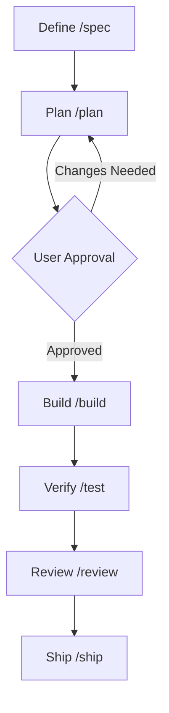

# CLAUDE.md — Agent Constitution & Project Guide

Welcome. This document defines the engineering guidelines, command reference, and workflows for agents (Claude, Cursor, Gemini) operating on this repository.

---

## 🚀 Quick Command Reference

Use these exact commands for common development operations. Do not hallucinate or guess.

### 🧪 Running Tests

- **All Tests**: `npm run test|vitest|jest|pytest|cargo test|sbt test|mvn test|gradle test`

### 🧹 Linting & Formatting

- **Run Lint**: `npm run lint|eslint|flake8|clippy|chktex`
- **Format Code**: `npm run format|prettier|black|fmt|scalafmt`

### ⚙️ Running Locally (Development)

- **Dev Server**: `pnpm dev`

---

## 🧭 Mandatory Engineering Workflow

You MUST execute all development tasks in the following sequential phases. Do not bypass or consolidate these phases.

1.  **Define (`/spec`)**: Analyze requirements, clarify ambiguities, identify impacted systems, and define constraints.
2.  **Plan (`/plan`)**: Author an `implementation_plan.md` outlining exact files to create/modify, verification plans, and open questions. **You must pause and obtain user approval here.**
3.  **Build (`/build`)**: Write clean, modular code. Write unit tests _before_ or _alongside_ implementation. Never write production code first and assume tests can wait.
4.  **Verify (`/test`)**: Run unit, integration, and linter suites. Address all errors and warnings before proceeding.
5.  **Review (`/review`)**: Perform a self-review of the diff, verify accessibility guidelines, check input sanitization, and audit console logs.
6.  **Ship (`/ship`)**: Formulate a concise change walkthrough and run final deployment validations.

---

## 🌿 Branching & Git Flow

To maintain Git hygiene and repository integrity, you MUST follow this branching model:

1. **Local Development**: All development and implementations must be done on the local `stage` branch.
2. **Local Merging**: When implementations are complete and verified, merge the local `stage` branch into the local `master` branch.
3. **Remote Syncing**: Push changes ONLY to the remote `stage` branch on GitHub (`git push origin stage`). Do not push directly to remote `master`.

---

## 🎨 Design & Coding Rules

- **No Placeholders**: Never use `TODO`, `FIXME`, or draft elements in code. Implement completed logic, fallback states, and complete error-handling patterns.
- **Decompose Components**: Avoid monolithic components. If a component exceeds 300 lines or contains independent sub-features, decompose it into smaller files and extract custom hooks.
- **Strict Error Handling**: Never use empty catch blocks. Always log errors properly on the backend or display friendly toasts/UI fallbacks on the frontend.
- **Security Gates**: Sanitise raw user inputs before rendering. Keep all secrets and configurations in environment variables.
- **TypeScript/Type Strictness**: Define proper types and interfaces for all models and payloads. Avoid `any` or lazy casting.
- **Avoid AI Slop & Verbosity**: Avoid AI writing patterns, excessive comments, boilerplate, or over-explanations. Code and logs must remain concise, direct, and professional.
- **No Code Deduplication**: Rigorously enforce the DRY (Don't Repeat Yourself) principle. Extract duplicate code block sequences, components, and configuration helpers into shared modules.
- **Diagnostics & Tooling**: Run local auditing tools such as `gsd` and `fallow` to trace unused code, dependencies, and verify project health. Always read and verify against the diagnostic guides inside `.claude/skills/` before altering subsystems.
